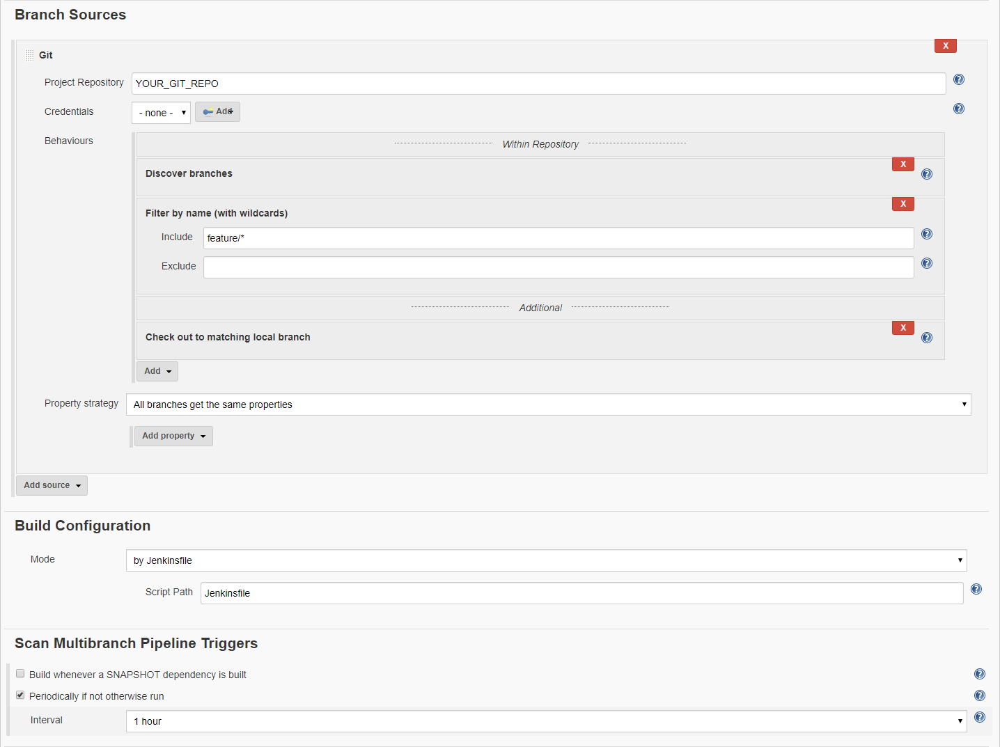

# Tutorial: Setup a feature branch build job

This tutorial covers the setup procedure for a multi branch job which
builds the feature branches.

:bulb: Feature branches are not deployed to nexus per default.

:exclamation: Setup your project for `develop` and `master` first, as
described in the [project setup tutorial](../setup-project/README.md)

# Table of contents
* [Background]()
* [Step 1: Add the Jenkinsfile to all of your feature branches](#step-1-add-the-jenkinsfile-to-all-of-your-feature-branches)
* [Step 2: Setup the Jenkins job.](#step-2-setup-the-jenkins-job)
* [Step 3: Check the scan log](#step-3-check-the-scan-log)

## Background

This tutorial assumes that we are talking about a customer named
'client' and a project named 'project' with a repository location at
https://git.company.tld/client/project.git and your feature branches are
following the naming convention `feature/<TICKET>`.

## Step 1: Add the Jenkinsfile to all of your feature branches

If the feature branches were not created after the project Jenkinsfile
was added to the repository you have to cherry-pick this Jenkinsfile
into every featurebranch of the project you want to build.

:bulb: The multi branch pipeline will only build branches matching the
selector which contain a Jenkinsfile.

Example:
```git
git checkout feature/<TICKET>
git cherry-pick <commit-hash-of-jenkins-file>
git push
```

### Step 2: Setup the Jenkins job.

* Go to the jenkins inside your client/project folder an add a new Job.
  * Following the naming convention the name should be
    _client_project_commit-features_
    * Choose Pipeline as job type and click ok  
    
* Scroll to _Branch Sources_ and add at _Git_ source
* Define the SCM
    * Repository URL: `<Your repository url>`
    * Credentials: `<The credentials to use>`
  * Add behaviors
    * _Discover branches_
    * _Filer by name (with wildcards)_ and define your includes
    * _Check out to matching local branch_
* Scroll to _Scan Multibranch Pipeline Triggers_ and select
  _Periodically if not otherwise run_ with an _Interval_ of _1 hour_ (or
  the value you need in your project)
* Your job config may now look similar to this screenshot  
  
* Click _Save_

### Step 3: Check the scan log

After save the scanning of the SCM starts. You can access the log by
going into the multi branch pipeline job (which represents a kind of a
folder)

You will se a output like this:
```text
[...]
Seen branch in repository origin/develop
Seen branch in repository origin/feature/PROJECT-1
Seen branch in repository origin/feature/PROJECT-2
Seen branch in repository origin/master
Seen 4 remote branches
Checking branch feature/PROJECT-1
      ‘Jenkinsfile’ found
Met criteria
Checking branch feature/PROJECT-2
      ‘Jenkinsfile’ found
Met criteria
Checking branch master
Checking branch develop
Done.
[Thu Jun 22 13:24:20 CEST 2017] Finished branch indexing. Indexing took 1 sec
Finished: SUCCESS
[...]
```

And for each branch where the criteria matched a job should be created
and the job should be queued for build.

:bulb: If the detection of branches is not working or the builds are
failing have a look into the logs for finding the cause. If you are
unable to solve the problem by yourself ask one of the friendly DevOps engineers
for assistance.


