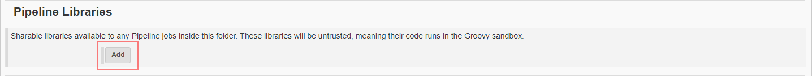
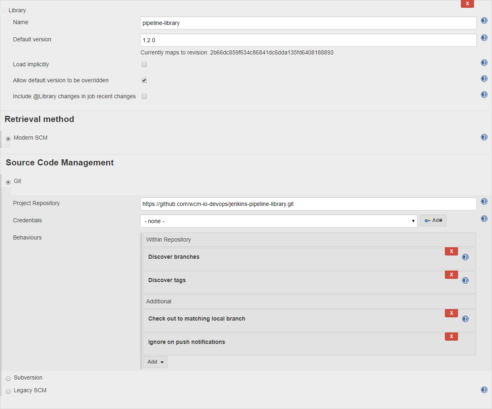
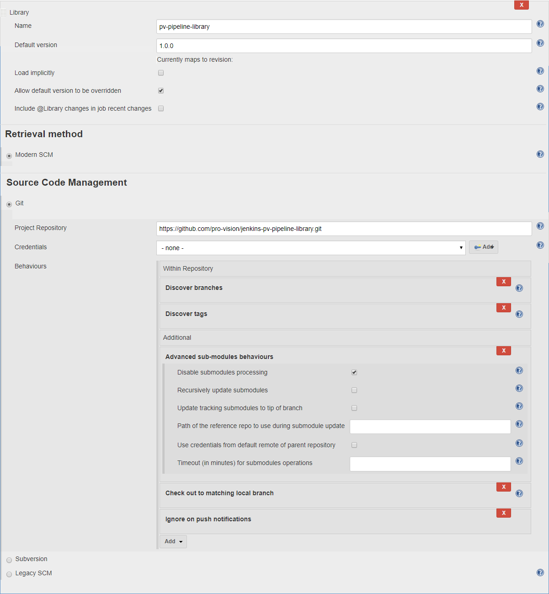
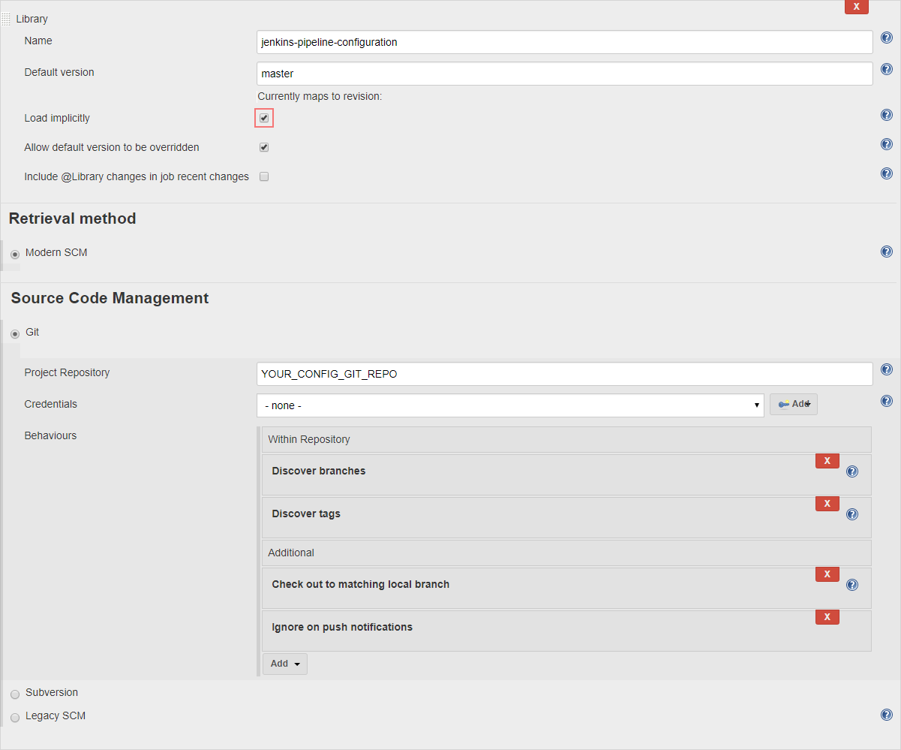

# Tutorial: Setup a project folder

:exclamation: In order to use the pv-pipeline library you have to setup
the pipeline-library accordingly! See
[pipeline library setup tutorial](https://github.com/wcm-io-devops/jenkins-pipeline-library/blob/master/docs/tutorial-setup.md)

This tutorial only covers the setup of pv-pipeline-library.

:bulb: Before you start, it is recommended to read
[Extending with Shared Libraries](https://jenkins.io/doc/book/pipeline/shared-libraries/)
from Jenkins documentation.

# Table of contents
* [Requirements](#requirements)
* [Tutorial Background](#tutorial-background)
* [Step 1: Configure the pv-pipeline-library.](#step-1-configure-the-pv-pipeline-library)
* [Step 2: Configure the wcm-io-devops jenkins-pipeline-library](#step-2-configure-the-wcm-io-devops-jenkins-pipeline-library)
* [Step 3: Configure the pro!vision jenkins-pv-pipeline-library](#step-3-configure-the-provision-jenkins-pv-pipeline-library)
* [Step 4: Configure the pipeline library configuration](#step-4-configure-the-pipeline-library-configuration)
* [Step 5: Ensure that the library is working](#step-5-ensure-that-the-library-is-working)

## Requirements

Have a look at [README](../../../README.md#requirements) to get the library running.

## Tutorial Background

In this tutorial we assume the following background.

You have a client named "Company" and a Folder named "Company" is
existing in the Jenkins instance

## Step 1: Configure the pv-pipeline-library.

Resulting from the setup of the
[pipeline library setup tutorial](https://github.com/wcm-io-devops/jenkins-pipeline-library/blob/master/docs/tutorial-setup.md)
you should have a git repository containing the configuration files for
the jenkins-pipeline-library.

In this repository you have to place a yaml containing the configuration
for the pv-pipeline-library.

:bulb: You can also create a new git repository for this but you have to
make sure that you add this library to your folder.

1. Copy the
   [config.yaml](../../../test/resources/pv-pipeline-library/config/config.yaml)
   to your config repository to `resources/pv-pipeline-library/config/config.yaml`
2. Adjust the default values to the values matching your Jenkins instance

## Step 2: Configure the wcm-io-devops jenkins-pipeline-library

There are several ways to include the library in your Jenkins instance:

* Global Shared Pipeline Library
* Folder based Shared Pipeline Library
* Project based Shared Pipeline Library
* Dynamic loading from SCM within your pipeline script.

It is recommended to use folder based shared library!

* Goto Jenkins and create a new folder named "Company".
* In the configure screen click on "Add" in the Pipeline Libraries
  section.  
  
* Configure the pipeline pipeline as in the following screenshot but
  check for the correct version/release!  
  

The settings ensure that tags and branches are discovered and no build
will be triggered when there is a change in the library.

## Step 3: Configure the pro!vision jenkins-pv-pipeline-library

* Goto "Company" folder in the Jenkins and open the configuration for
  the folder
* In the configure screen click on "Add" in the Pipeline Libraries
  section.  
  
  Configure the pipeline pipeline as in the following screenshot but
  check for the correct version/release!  
  

The settings ensure that tags and branches are discovered and no build
will be triggered when there is a change in the library.

I also disables the submodule processing since the pv-pipeline-library
has the wcm-io-devops jenkins-pipeline-library as git submodule configured.

## Step 4: Configure the pipeline library configuration

* Goto "Company" folder in the Jenkins and open the configuration for
  the folder
* In the configure screen click on "Add" in the Pipeline Libraries
  section.  
  
* Configure the pipeline pipeline as in the following screenshot but
  check for the correct version/release! Also replace
  YOUR_CONFIG_GIT_REPO with your git repository, and set credentials if
  needed.  
  

The settings ensure that tags and branches are discovered and no build
will be triggered when there is a change in the library.

The config library is loaded implicit in this case. So no need to do a
`@Library [...]` in your jenkins files. This separated config from the library.

## Step 5: Ensure that the library is working

* Goto to the "Company" job folder and create a new Pipeline job named
  'Test'
* Add the following script in the Pipeline script field:
  ```groovy
  @Library ('pipeline-library') pipelineLibrary
  @Library ('pv-pipeline-library') pvPipelineLibrary
  
  node() {
      setupPVTools()
      echo "Maven home: $MAVEN_HOME"
      echo "Java home: $JAVA_HOME"
  }  
  ```
* run the job

You should see some checkout logs and at the end of the job the a output
similar to this:

```text
[Pipeline] echo
Maven home: /root/tools/hudson.tasks.Maven_MavenInstallation/apache-maven3
[Pipeline] echo
Java home: /root/tools/hudson.model.JDK/sun-java8-jdk
[Pipeline] }
[Pipeline] // node
[Pipeline] End of Pipeline
Finished: SUCCESS
```

Congratulations, you are now ready to use the pv pipeline library inside
and below this folder.
