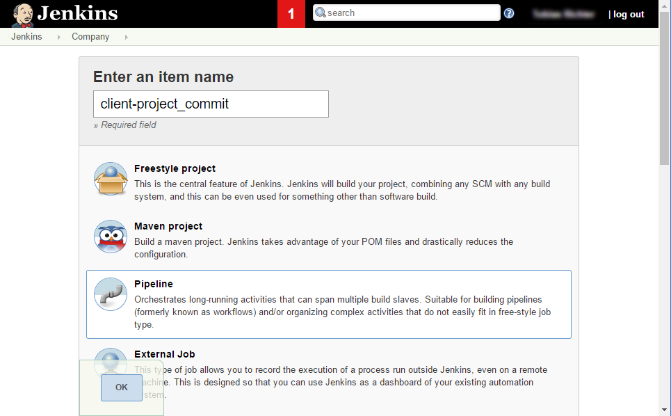
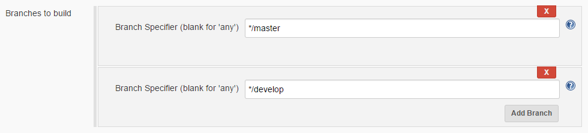

# Tutorial: Setup a project

This tutorial helps you to setup your project for pipeline builds for
"normal" branches like `develop` and `master` with snapshot deployment
to nexus.

:bulb: Have a look at the executed steps
[`routeDefaultJenkinsFile`](../../../vars/routeDefaultJenkinsFile.md) and
[`buildDefault`](../../../vars/buildDefault.md) for more information

Multi branch builds for feature branches like `feature/FEATURE-1 without
snapshot deployments to nexus are covered by the
[feature branch tutorial](../setup-feature-branch/README.md)

:exclamation: You have to setup your project first (based on this
tutorial), before you should setup feature branch builds!

# Table of contents
# [Background](#background)
* [Step 1: Setup the auto lookup](#step-1-setup-the-auto-lookup)
* [Step 2: Add the pipeline libraries to your Jenkins client folder](#step-2-add-the-pipeline-libraries-to-your-jenkins-client-folder)
* [Step 3: Add JenkinsFile to `develop` branch](#step-3-add-jenkinsfile-to-develop-branch)
* [Step 4: Setup the Jenkins job.](#step-4-setup-the-jenkins-job)
* [Step 5: Execute the Jenkins job](#step-5-execute-the-jenkins-job)
* [Step 6: Add Jenkinsfile to `master` branch](#step-6-add-jenkinsfile-to-master-branch)
* [Step 7: Step 7: Configure your job to build `develop` and `master` branch](#step-7-configure-your-job-to-build-develop-and-master-branch)
* [Step 8: Configure a multi branch pipeline build](#step-8-configure-a-multi-branch-pipeline-build)

## Background

This tutorial assumes that we are talking about a customer named
'client' and a project named 'project' with a repository location at
https://git.company.tld/client/project.git.

## Step 1: Setup the auto lookup

If you have to use custom configurations for:
* Global Maven settings
* Maven settings
* SCM credentials
* NPM user config
* NPMRC config
* Ruby bundler config

please have a look at [Setup your environment for pipeline library](https://github.com/wcm-io-devops/jenkins-pipeline-library/blob/master/docs/tutorial-setup.md#step-3-setup-managed-file-and-credential-auto-lookup)

:bulb: In the most cases only a custom maven settings configuration
should be needed for deploying to the nexus, see
[maven-local-settings](https://github.com/wcm-io-devops/jenkins-pipeline-library/blob/master/docs/tutorial-setup.md#maven-local-settings)

## Step 2: Add the pipeline libraries to your Jenkins client folder

If not already done, have a look at the
[Setup tutorial](../setup-project-folder/README.md).

## Step 3: Add JenkinsFile to `develop` branch

It is recommended to use a `Jenkinsfile` stored at project root.

Assuming that you want to build with the default tools (JDK8, Maven3)
and Settings all you have to add in your Jenkinsfile is:

```
@Library('pipeline-library') pipelineLibrary
@Library('pv-pipeline-library') pvPipelineLibrary

routeDefaultJenkinsFile()
```

Commit and Push this Jenkinsfile to the repository.

Please have a look at
* [`routeDefaultJenkinsFile`](../../../vars/routeDefaultJenkinsFile.md)
* [`buildDefault`](../../../vars/buildDefault.md)
* [`buildFeature`](../../../vars/buildFeature.md)

for more information and documentation.

:bulb: For configuration documentation and examples have a look at [Configuration](../../config-structure.md).

## Step 4: Setup the Jenkins job.

* Go to the jenkins inside your client/project folder an add a new Job.
  * Following the naming convention the name should be
    _client-project_commit_
    * Choose Pipeline as job type and click ok  
      
* Scroll down to _Pipeline_ and change _Definition_ from _Pipeline Script_
  to _Pipeline script from SCM_
* Define the SCM
    * SCM: `git`
    * Repository URL: `<Your repository url>`
    * Credentials: `<The credentials to use>`
  * Branches to build: Change the branch to `*/develop` (After testing
    is complete you have to define `*/master` and `*/develop` here
  * Add _Additional Behaviors_ (:exclamation: This is needed to enable
    branch name detection when running in untrusted mode, see [`setGitBranch`](https://github.com/wcm-io-devops/jenkins-pipeline-library/blob/master/vars/setGitBranch.md)
    * Add the "Checkout to specific local branch" extension:  
      
* Click _Save_

:bulb: It is recommended to use ssh for git. Ensure that the jenkins
deploy key ci_server is enabled for your project!

## Step 5: Execute the Jenkins job

Start a Build and observe the logs.

You should see the following log entries (excerpt)
```text
11:47:16 [INFO] setupTools : set environment var 'MAVEN_HOME' to: '/root/tools/hudson.tasks.Maven_MavenInstallation/apache-maven3'
11:47:16 [INFO] setupTools : set environment var PATH to: /root/tools/hudson.tasks.Maven_MavenInstallation/apache-maven3/bin:/usr/local/sbin:/usr/local/bin:/usr/sbin:/usr/bin:/sbin:/bin
11:47:16 [INFO] setupTools : set environment var 'JAVA_HOME' to: '/root/tools/hudson.model.JDK/sun-java8-jdk'
11:47:16 [INFO] setupTools : set environment var PATH to: /root/tools/hudson.model.JDK/sun-java8-jdk/bin:/root/tools/hudson.tasks.Maven_MavenInstallation/apache-maven3/bin:/usr/local/sbin:/usr/local/bin:/usr/sbin:/usr/bin:/sbin:/bin
[...]
11:47:17 [INFO] checkoutScm : Found configuration to use existing scm var, checking out with scm configuration from job
[...]
11:47:20 [INFO] setGitBranch : set environment var GIT_BRANCH to 'develop'
[...]
11:47:20 [INFO] setScmUrl : Setting environment variable SCM_URL to https://git.company.tld/client/project.git
[...]
11:47:20 [INFO] setBuildName : created version number -> () #81_master
[...]
11:47:20 [INFO] deleteProjectArtifactsFromRepository : trying to retrieve group id from pom: pom.xml
[...]
11:47:22 [INFO] execMaven : executing maven with: mvn clean deploy -B -U -Dcontinuous-integration=true --global-settings '/root/workspace/client/project/client-project_commit@tmp/config8940688209650350754tmp' --settings '/root/workspace/client/project/client-project_commit@tmp/config889085921613369759tmp'
[...]
11:47:22 [INFO] execMaven : executing maven with: mvn checkstyle:checkstyle pmd:pmd spotbugs:spotbugs -B --global-settings '/root/workspace/client/project/client-project_commit@tmp/config8940688209650350754tmp' --settings '/root/workspace/client/project/client-project_commit@tmp/config889085921613369759tmp'
[...]
11:50:34 Recording test results
[INFO] notifyMail : Notification not enabled for: SUCCESS
[...]
[Pipeline] End of Pipeline
Finished: SUCCESS
```

:bulb: If your build is not successful check the cause in the log and
ask one of the one of the friendly DevOps engineers for assistance.

## Step 6: Add Jenkinsfile to `master` branch

If everything went fine you can now add the Jenkinsfile to the `master`
branch of the repository.

You can do this by your preferred method, but cherry-picking is the
preferred method here

### Step 7: Configure your job to build `develop` and `master` branch

* Open the Job configuration page and scroll down to the _Pipeline_
  section.
* In the _Branches to build_ section define two branches
  * `*/master`
  * `*/develop`  
  
* Click _Save_

:+1: Congratulations! You are done with the ci job for `develop` and
`master`.

## Step 8: Configure a multi branch pipeline build

If needed you now can setup a multi branch pipeline Job for your project.

:bulb: Have a look at the
[Feature branch tutorial](../setup-feature-branch/README.md) to get startet.
